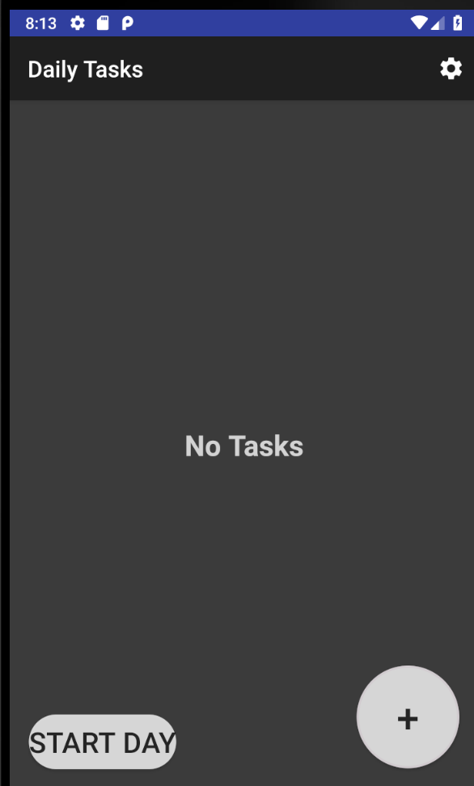
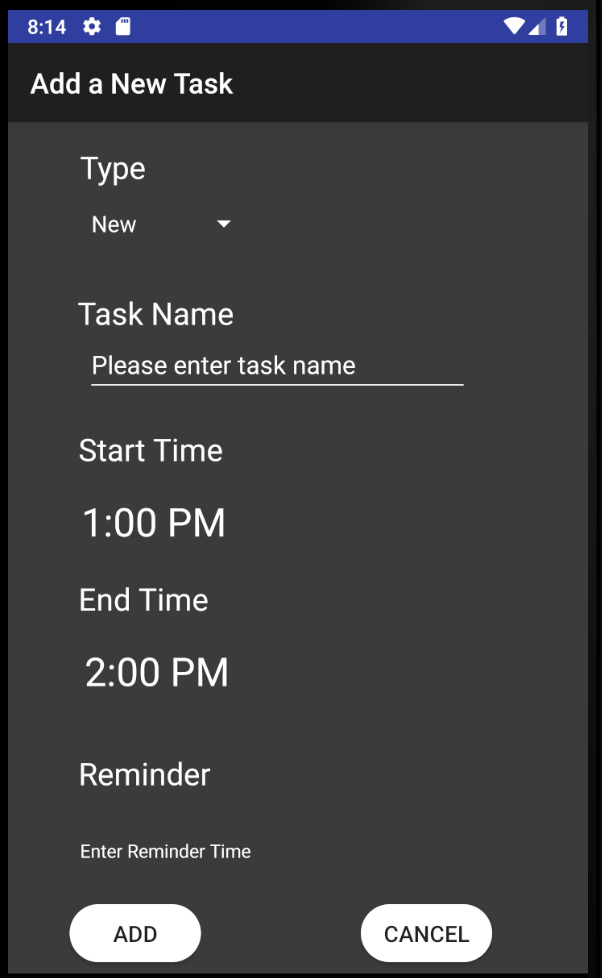
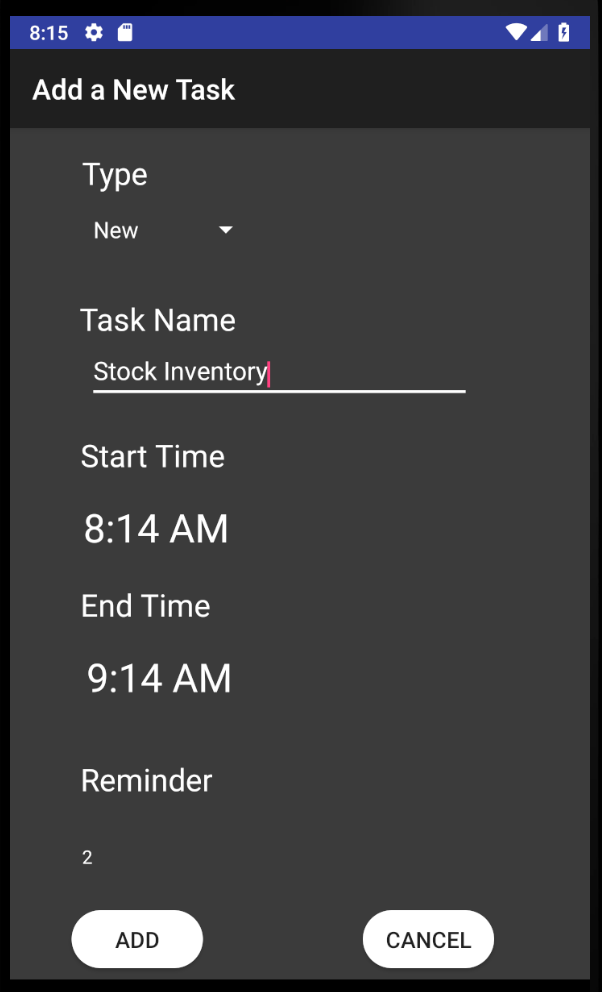
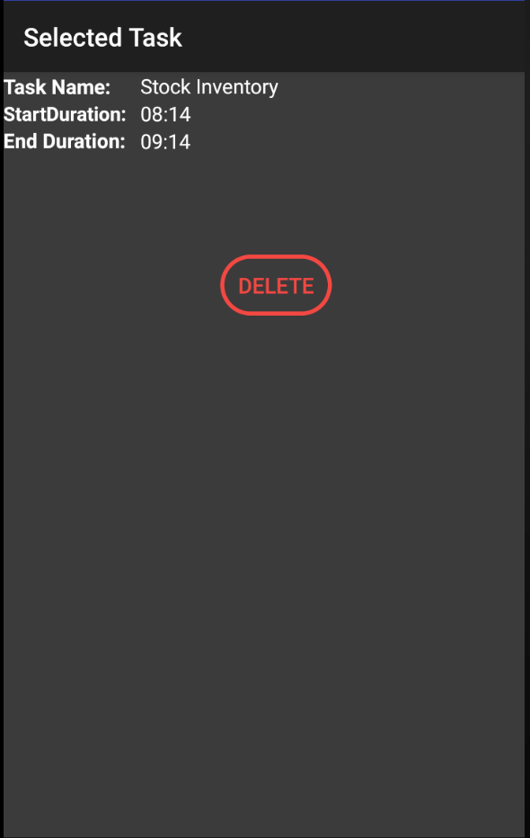
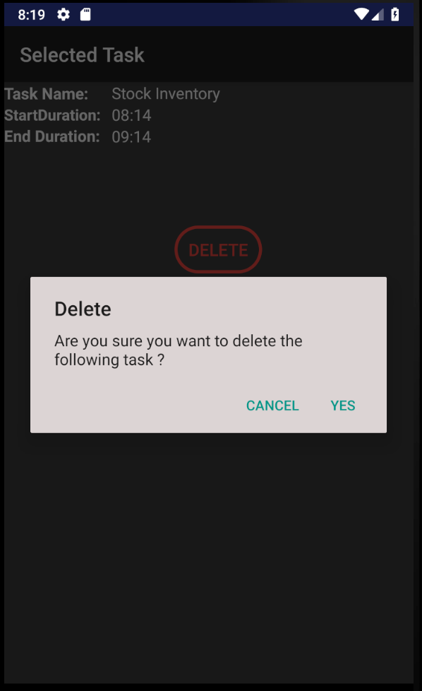
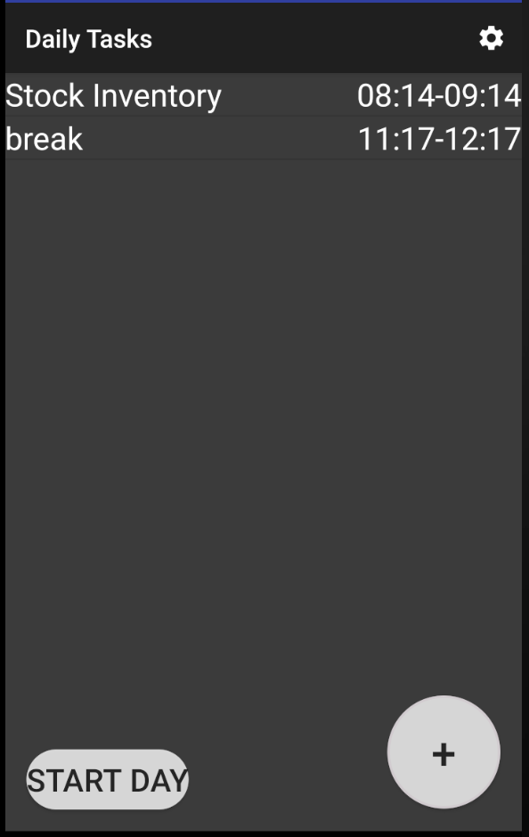
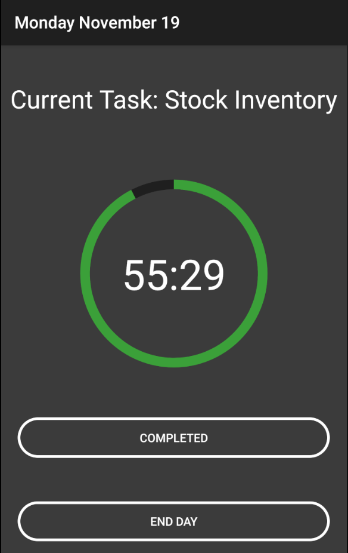
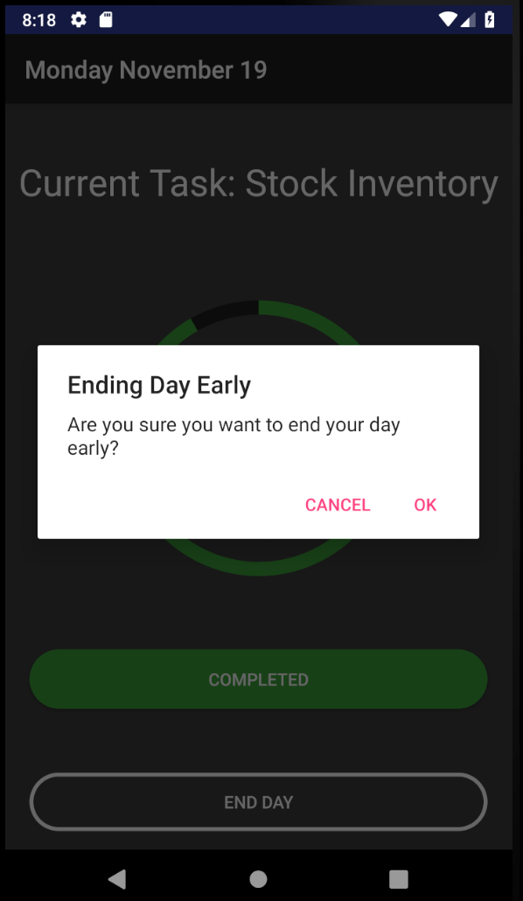
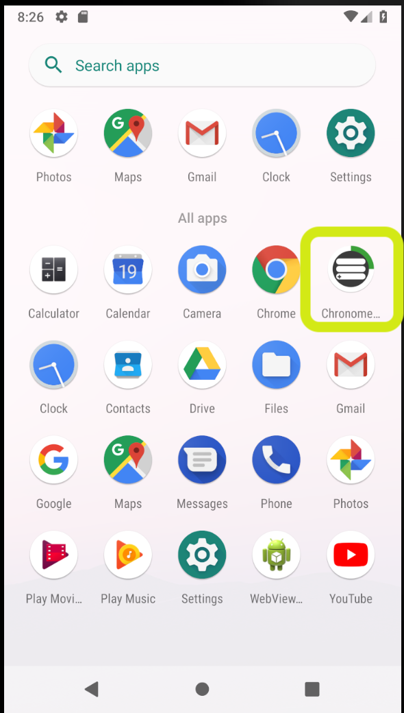

# Chronometer
Chronometer application - GNG 2105
This Android application provides a user friendly chronometer to assist in daily activity scheduling. The application has been specifically designed for a company which works with people that have disabilities. The simple yet effective UI design ensures the user can navigate easily without being overwhelmed. The application also includes TalkBack functionality for the visually disabled.

